# 시퀀스 다이어그램
> 본 문서는 이커머스 기능 구현을 위한 도메인 간 상호작용 흐름을 정리한 문서입니다.
> 기능별 시나리오를 시퀀스 다이어그램으로 시각화 하여 흐름과 예외상황을 파악할 수 있도록 구성하였습니다.

## 사용자
#### 회원가입 (POST /api/v1/users)
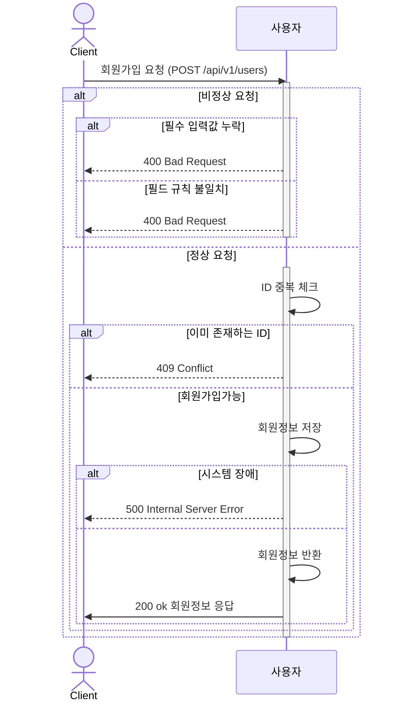
#### 내정보조회 (POST /api/v1/users/me)
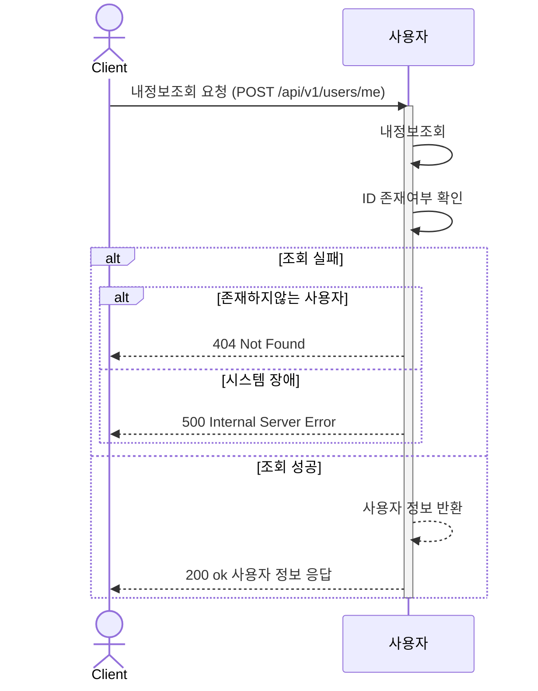
---

## 포인트
#### 포인트 충전(POST /api/v1/points/charge)

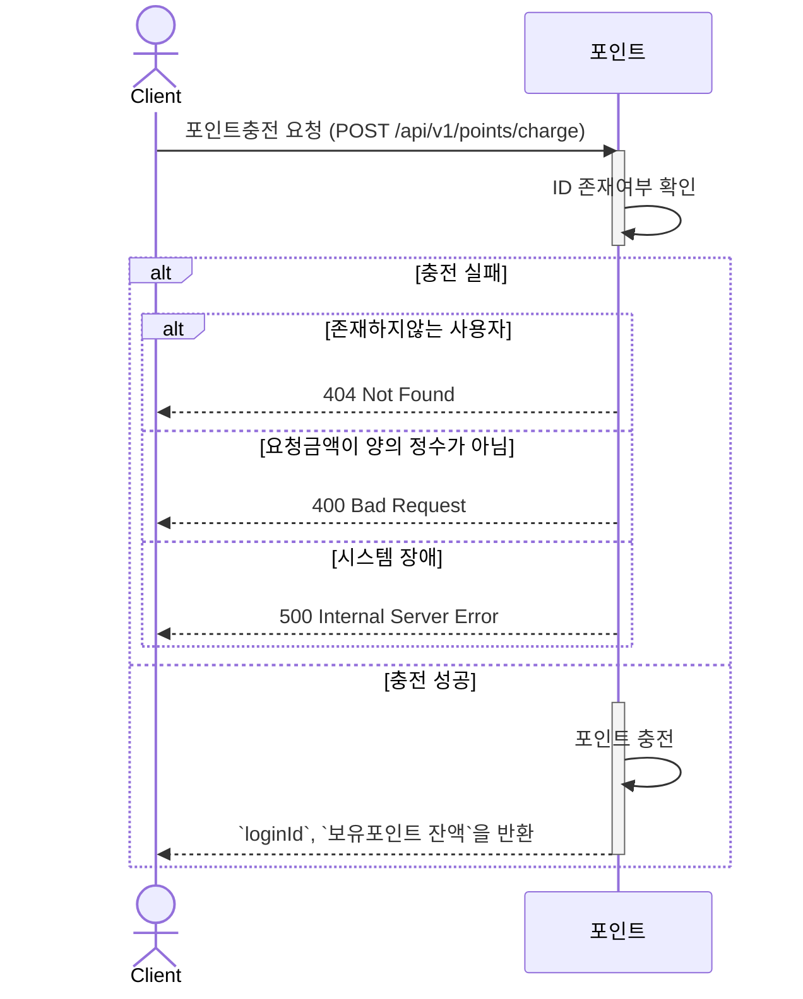
#### 포인트 조회 (GET /api/v1/points)
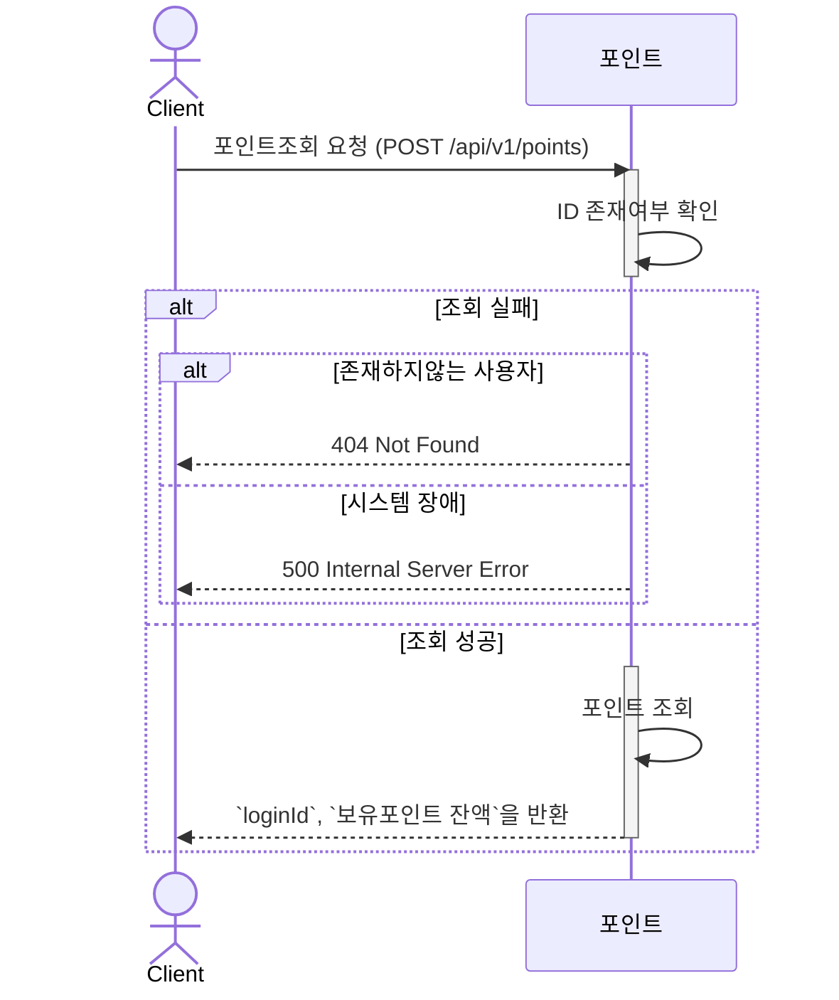
---
## 브랜드 & 상품
#### 브랜드정보 조회 (GET /api/v1/brands/{brandId})

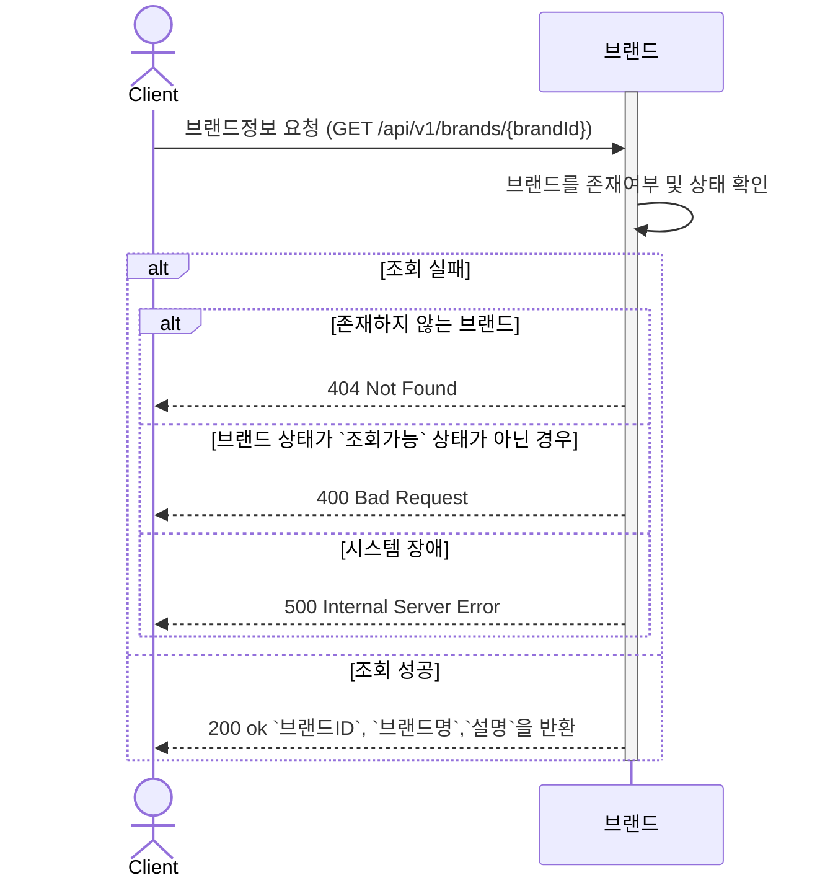

#### 상품 목록 정보 조회 (GET /api/v1/products)

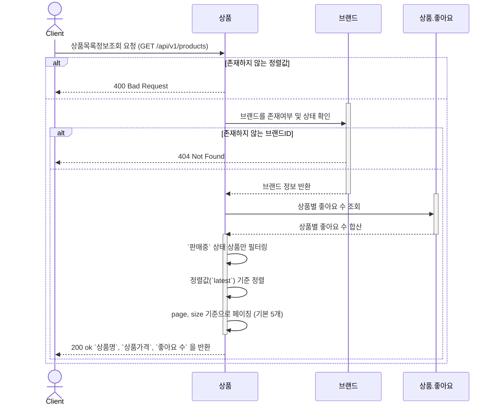

#### 상품 상세 정보 조회 (GET /api/v1/products/{productid})

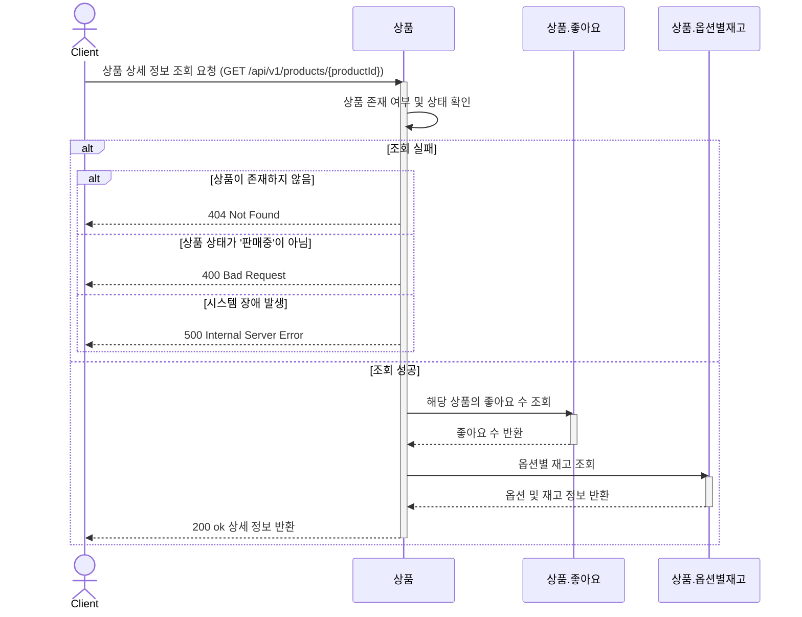
---

## 좋아요
#### 좋아요 등록  (POST /api/v1/products/{productId}/likes )

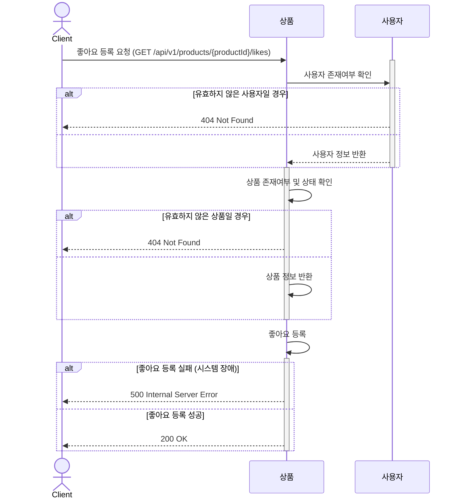
#### 좋아요 취소  (DELETE /api/v1/products/{productId}/likes )

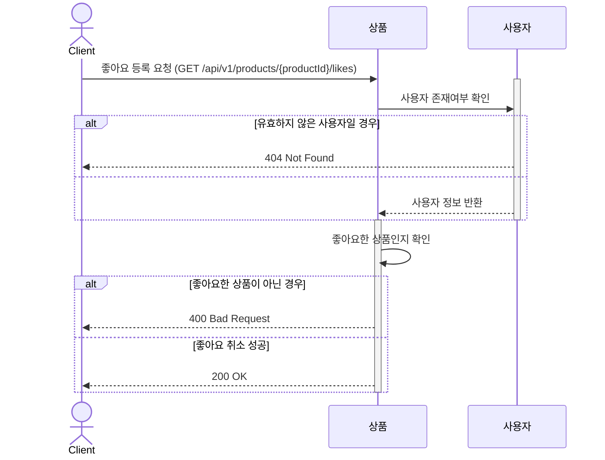

#### 내가 좋아요한 상품 목록 조회 (GET /api/v1/products/likes)
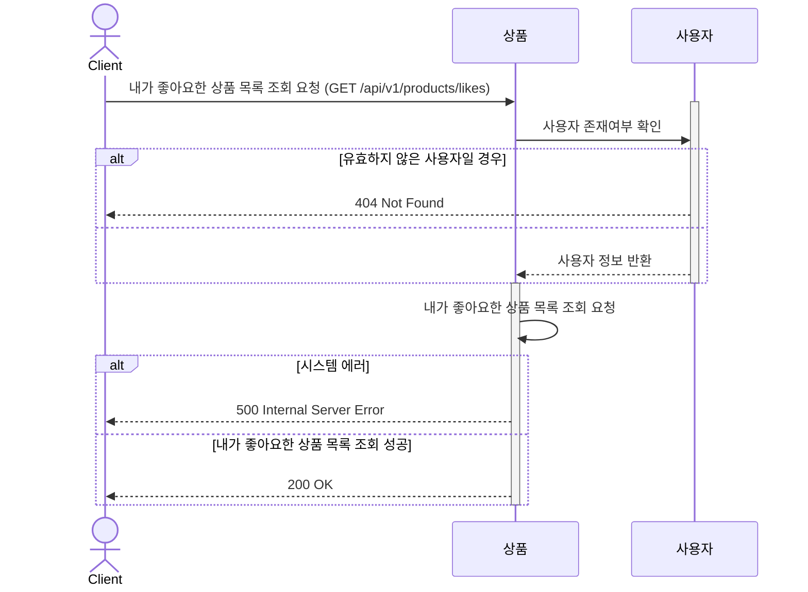
---
## 주문
#### 주문요청 (POST /api/v1/orders)

```mermaid
sequenceDiagram
    actor Client as Client
    participant 주문 as 주문
    participant 상품 as 상품
    participant 상품옵션재고 as 상품.옵션별재고
    participant 사용자 as 사용자

    Client ->> 주문: 주문요청 (POST /api/v1/orders)

    activate 사용자
    주문 ->> 사용자: 사용자 조회 
    alt 유효하지 않은 사용자일 경우 
        사용자 -->> Client: 404 Not Found (사용자 없음)
    else 사용자 존재
        사용자 -->> 주문: 사용자 정보 반환
        주문 ->> 상품옵션재고: 재고 조회
        deactivate 사용자
        activate 상품옵션재고
        alt 존재하지 않는 상품 옵션
            상품옵션재고 -->> Client: 404 Not Found (상품옵션 없음)
        else 재고 부족
            상품옵션재고 -->> Client: 400 Bad Request (재고 부족)
        else 재고 충분
        
            상품옵션재고 -->> 주문: 재고 선점 완료
            deactivate 상품옵션재고
            activate 상품
            주문 ->> 상품: 전체 옵션 재고 확인
            상품 ->> 상품: 모든 옵션 재고가 0인지 확인
            alt 전체 품절 상태
                상품 ->> 상품: 상태를 `SOLD_OUT`로 변경
            end
            deactivate 상품
            activate 주문
            주문 ->> 주문: 주문 생성(주문금액, 옵션목록, 주문일자)
            주문 -->> Client: 200 OK + 주문정보 반환
            deactivate 주문
        end
    end
 ```

#### 주문취소요청  (POST /api/v1/orders/{orderId}/cancellation)
```mermaid
sequenceDiagram
    actor Client as Client
    participant 주문 as 주문
    participant 재고 as 상품옵션재고

    Client ->> 주문: 주문취소요청 (POST /api/v1/orders/{orderId}/cancellation)
    activate 주문
    주문 ->> 주문: 주문 조회
    alt 존재하지 않는 주문
        주문 -->> Client : 404 Not Found
    else 이미 취소된 주문
        주문 -->> Client : 409 Conflict
    else 본인의 주문이 아님
        주문 -->> Client :  403 Forbidden
    else 취소 가능한 주문
        주문 -->> 주문: 주문정보 반환
        activate 재고 
        주문 ->> 재고: 선점된 재고 원복
        deactivate 재고
        주문 ->> 주문: 주문 상태 `CANCELED`로 변경
        주문 -->> Client: 200 OK
    end
    deactivate 주문
```
#### 주문 목록 조회 (GET /api/v1/users/{userId}/orders)

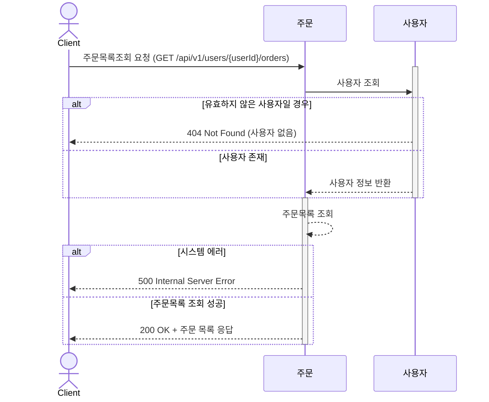

#### 단일 주문 조회 (GET / api/v1/orders/{orderId})

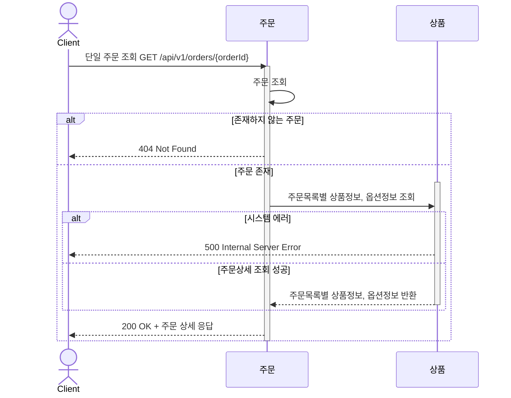

---
## 결제
#### 결제요청  (POST /api/v1/orders/{orderId}/payments)

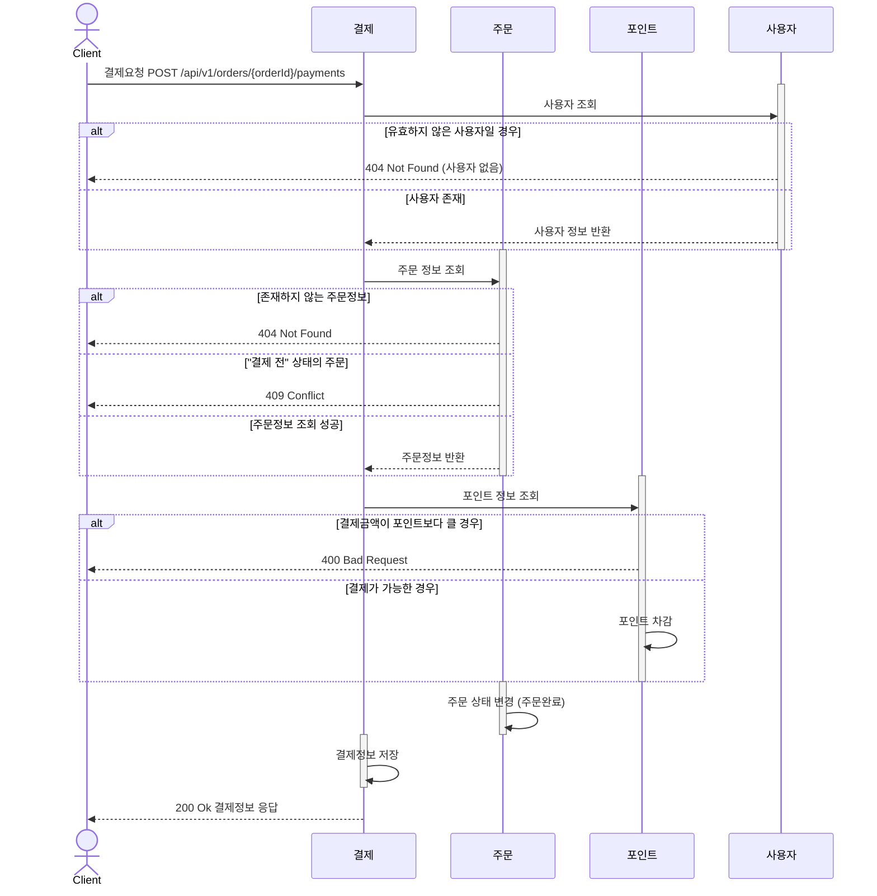
#### 결제취소요청 (DELETE /api/v1/orders/{orderId}/payments/{paymentId})
 ```mermaid
 sequenceDiagram
   actor Client as Client

   participant 결제 as 결제
   participant 주문 as 주문
   participant 포인트 as 포인트
   participant 상품옵션별재고 as 상품.옵션별재고
   participant 사용자 as 사용자

   activate 결제

   Client ->> 결제: 결제취소요청 DELETE /api/v1/orders/{orderId}/payments/{paymentId}
   activate 사용자
   결제 ->> 사용자 : 사용자 조회
   alt 유효하지 않은 사용자일 경우 
       사용자 -->> Client: 404 Not Found 
   else 사용자 존재
       사용자 -->> 결제: 사용자 정보 반환
   end
   deactivate 사용자

   결제 ->> 결제 : 결제 정보 조회

   activate 주문
   결제 ->> 주문 : 주문 정보 조회 
   alt 존재하지 않는 주문정보 
       주문 -->> Client: 404 Not Found 
   else 이미 취소된 주문
       주문 -->> Client: 409 Conflict
   else 주문정보 조회 성공공
       주문 -->> 결제: 주문정보 반환
   end
   deactivate 주문

   activate 상품옵션별재고
   결제 ->> 상품옵션별재고 : 재고 정보 조회
   상품옵션별재고 ->> 상품옵션별재고 : 주문정보에 기반한 재고수량 원복
   alt 시스템 에러
       상품옵션별재고 -->> Client: 500 Internal Server Error
   end
   deactivate 상품옵션별재고

   activate 주문
   결제 ->> 주문 : 주문 정보 조회
   주문 -->> 주문: 주문상태 변경 "주문취소"
   deactivate 주문

   activate 포인트
   결제 ->> 포인트 : 포인트 복구
   포인트 -->> 포인트 : 포인트 복구
   deactivate 포인트

   결제 -->> 결제 : 결제상태 "결제 취소" 로 변경
   
   deactivate 결제
 ```
