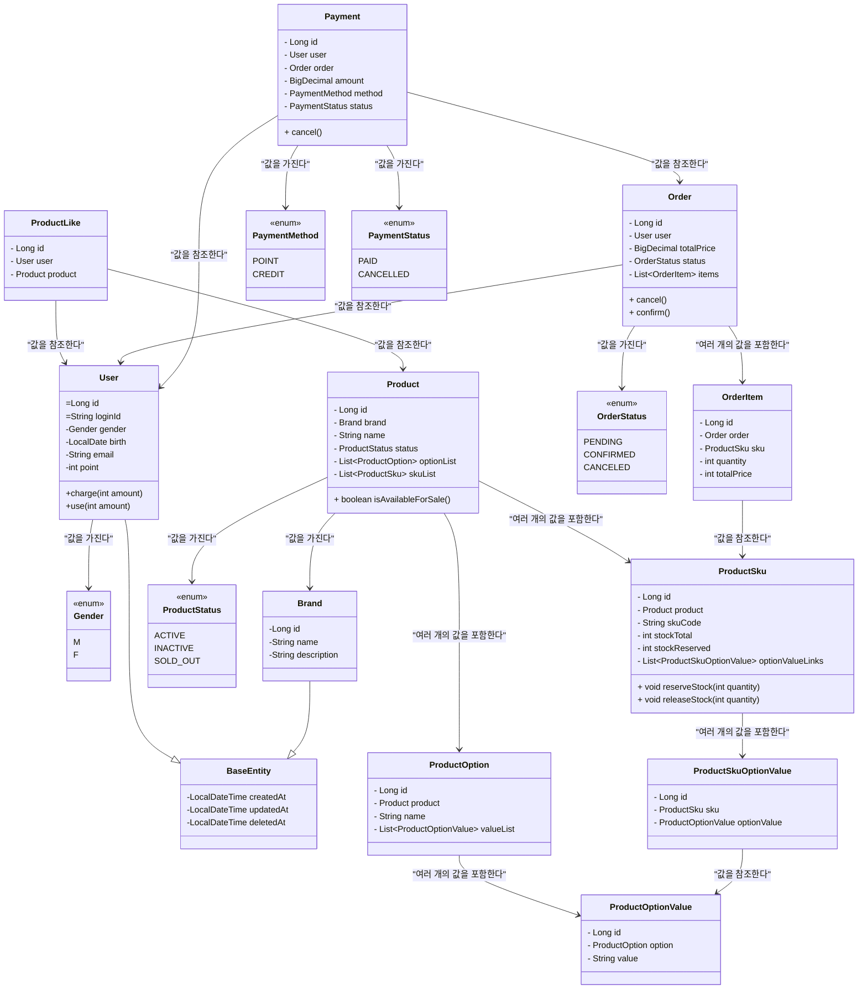

# 클래스 다이어그램
> 본 문서는 이커머스 기능구현을 위한 도메인을 구성하는 주요 객체들의 구조와 관계를 정리한 문서입니다.

```mermaid
classDiagram

%% Base Entity
class BaseEntity {
  -LocalDateTime createdAt
  -LocalDateTime updatedAt
  -LocalDateTime deletedAt
}

%% User
class User {
  =Long id
  =String loginId
  -Gender gender
  -LocalDate birth
  -String email
  -int point
  +charge(int amount)
  +use(int amount)
}
User --|> BaseEntity
User --> Gender : "값을 가진다"

class Gender {
  <<enum>>
  M
  F
}

%% Brand
class Brand {
  -Long id
  -String name
  -String description
}
Brand --|> BaseEntity

%% Product Domain
class Product {
  - Long id
  - Brand brand
  - String name
  - ProductStatus status
  - List~ProductOption~ optionList
  - List~ProductSku~ skuList

  + boolean isAvailableForSale()
}
Product --> ProductStatus : "값을 가진다"
Product --> Brand : "값을 가진다"
Product --> ProductOption : "여러 개의 값을 포함한다"
Product --> ProductSku : "여러 개의 값을 포함한다"

class ProductStatus {
  <<enum>>
  ACTIVE
  INACTIVE
  SOLD_OUT
}

class ProductOption {
  - Long id
  - Product product
  - String name
  - List~ProductOptionValue~ valueList
}
ProductOption --> ProductOptionValue : "여러 개의 값을 포함한다"

class ProductOptionValue {
  - Long id
  - ProductOption option
  - String value
}

class ProductSku {
  - Long id
  - Product product
  - String skuCode
  - int stockTotal
  - int stockReserved
  - List~ProductSkuOptionValue~ optionValueLinks

  + void reserveStock(int quantity)
  + void releaseStock(int quantity)
}
ProductSku --> ProductSkuOptionValue : "여러 개의 값을 포함한다"

class ProductSkuOptionValue {
  - Long id
  - ProductSku sku
  - ProductOptionValue optionValue
}
ProductSkuOptionValue --> ProductOptionValue : "값을 참조한다"

class ProductLike {
  - Long id
  - User user
  - Product product
}
ProductLike --> User : "값을 참조한다"
ProductLike --> Product : "값을 참조한다"

%% Order Domain
class Order {
  - Long id
  - User user
  - BigDecimal totalPrice
  - OrderStatus status
  - List~OrderItem~ items

  + cancel()
  + confirm()
}
Order --> User : "값을 참조한다"
Order --> OrderStatus : "값을 가진다"
Order --> OrderItem : "여러 개의 값을 포함한다"

class OrderStatus {
  <<enum>>
  PENDING
  CONFIRMED
  CANCELED
}

class OrderItem {
  - Long id
  - Order order
  - ProductSku sku
  - int quantity
  - int totalPrice
}
OrderItem --> ProductSku : "값을 참조한다"

%% Payment Domain
class Payment {
  - Long id
  - User user
  - Order order
  - BigDecimal amount
  - PaymentMethod method
  - PaymentStatus status

  + cancel()
}
Payment --> User : "값을 참조한다"
Payment --> Order : "값을 참조한다"
Payment --> PaymentMethod : "값을 가진다"
Payment --> PaymentStatus : "값을 가진다"

class PaymentMethod {
  <<enum>>
  POINT
  CREDIT
}

class PaymentStatus {
  <<enum>>
  PAID
  CANCELLED
}

```
