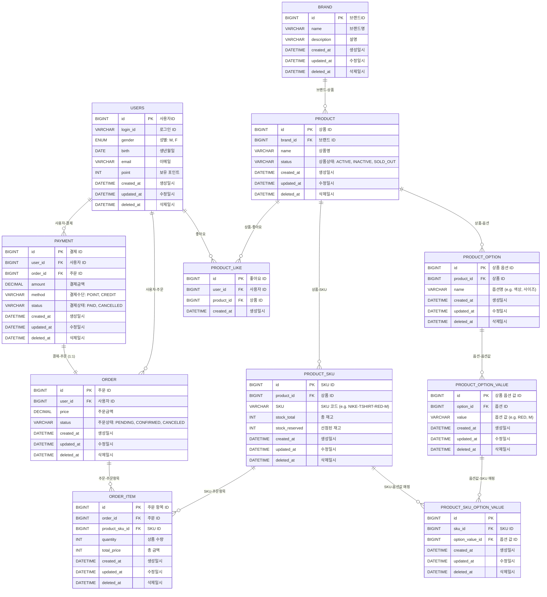

# ERD
> 본 문서는 이커머스 기능 구현을 위한 주요 도메인과 테이블 간 관계를 정리한 문서입니다.

```mermaid
erDiagram

%% 테이블 정의

  USERS {
    BIGINT id PK "사용자ID"
    VARCHAR login_id "로그인 ID"
    ENUM gender "성별: M, F"
    DATE birth "생년월일"
    VARCHAR email "이메일"
    INT point "보유 포인트"
    DATETIME created_at "생성일시"
    DATETIME updated_at "수정일시"
    DATETIME deleted_at "삭제일시"
  }

  BRAND {
    BIGINT id PK "브랜드ID"
    VARCHAR name "브랜드명"
    VARCHAR description "설명"
    DATETIME created_at "생성일시"
    DATETIME updated_at "수정일시"
    DATETIME deleted_at "삭제일시"
  }

  PRODUCT {
    BIGINT id PK "상품 ID"
    BIGINT brand_id FK "브랜드 ID"
    VARCHAR name "상품명"
    VARCHAR status "상품상태: ACTIVE, INACTIVE, SOLD_OUT"
    DATETIME created_at "생성일시"
    DATETIME updated_at "수정일시"
    DATETIME deleted_at "삭제일시"
  }

  PRODUCT_OPTION {
    BIGINT id PK "상품 옵션 ID"
    BIGINT product_id FK "상품 ID"
    VARCHAR name "옵션명 (e.g. 색상, 사이즈)"
    DATETIME created_at "생성일시"
    DATETIME updated_at "수정일시"
    DATETIME deleted_at "삭제일시"
  }

  PRODUCT_OPTION_VALUE {
    BIGINT id PK "상품 옵션 값 ID"
    BIGINT option_id FK "옵션 ID"
    VARCHAR value "옵션 값 (e.g. RED, M)"
    DATETIME created_at "생성일시"
    DATETIME updated_at "수정일시"
    DATETIME deleted_at "삭제일시"
  }

  PRODUCT_SKU {
    BIGINT id PK "SKU ID"
    BIGINT product_id FK "상품 ID"
    VARCHAR SKU "SKU 코드 (e.g. NIKE-TSHIRT-RED-M)"
    INT stock_total "총 재고"
    INT stock_reserved "선점된 재고"
    DATETIME created_at "생성일시"
    DATETIME updated_at "수정일시"
    DATETIME deleted_at "삭제일시"
  }

  PRODUCT_SKU_OPTION_VALUE {
    BIGINT id PK
    BIGINT sku_id FK "SKU ID"
    BIGINT option_value_id FK "옵션 값 ID"
    DATETIME created_at "생성일시"
    DATETIME updated_at "수정일시"
    DATETIME deleted_at "삭제일시"
  }

  PRODUCT_LIKE {
    BIGINT id PK "좋아요 ID"
    BIGINT user_id FK "사용자 ID"
    BIGINT product_id FK "상품 ID"
    DATETIME created_at "생성일시"
  }

  ORDER {
    BIGINT id PK "주문 ID"
    BIGINT user_id FK "사용자 ID"
    DECIMAL price "주문금액"
    VARCHAR status "주문상태: PENDING, CONFIRMED, CANCELED"
    DATETIME created_at "생성일시"
    DATETIME updated_at "수정일시"
    DATETIME deleted_at "삭제일시"
  }

  ORDER_ITEM {
    BIGINT id PK "주문 항목 ID"
    BIGINT order_id FK "주문 ID"
    BIGINT product_sku_id FK "SKU ID"
    INT quantity "상품 수량"
    INT total_price "총 금액"
    DATETIME created_at "생성일시"
    DATETIME updated_at "수정일시"
    DATETIME deleted_at "삭제일시"
  }

  PAYMENT {
    BIGINT id PK "결제 ID"
    BIGINT user_id FK "사용자 ID"
    BIGINT order_id FK "주문 ID"
    DECIMAL amount "결제금액"
    VARCHAR method "결제수단: POINT, CREDIT"
    VARCHAR status "결제상태: PAID, CANCELLED"
    DATETIME created_at "생성일시"
    DATETIME updated_at "수정일시"
    DATETIME deleted_at "삭제일시"
  }

 %% 관계 정의

  BRAND ||--o{ PRODUCT : "브랜드-상품"

  PRODUCT ||--o{ PRODUCT_OPTION : "상품-옵션"
  PRODUCT ||--o{ PRODUCT_SKU : "상품-SKU"
  PRODUCT ||--o{ PRODUCT_LIKE : "상품-좋아요"
  USERS ||--o{ PRODUCT_LIKE : "좋아요"

  PRODUCT_OPTION ||--o{ PRODUCT_OPTION_VALUE : "옵션-옵션값"
  PRODUCT_SKU ||--o{ PRODUCT_SKU_OPTION_VALUE : "SKU-옵션값 매핑"
  PRODUCT_OPTION_VALUE ||--o{ PRODUCT_SKU_OPTION_VALUE : "옵션값-SKU 매핑"

  USERS ||--o{ ORDER : "사용자-주문"
  ORDER ||--o{ ORDER_ITEM : "주문-주문항목"
  PRODUCT_SKU ||--o{ ORDER_ITEM : "SKU-주문항목"

  USERS ||--o{ PAYMENT : "사용자-결제"
  PAYMENT ||--|| ORDER : "결제-주문 (1:1)"

```